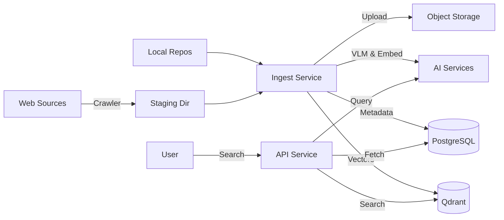

# GEMINI.md - Context for AI Assistants

This file provides high-level context, architectural details, and operational instructions for the `emomo` project. Use this to understand the codebase and assist with tasks effectively.

## 1. Project Overview

**Emomo** is a meme search engine that ingests memes from various sources, indexes them using vector embeddings and visual language models (VLM), and provides a semantic search API.

### Core Components
*   **Crawler (Python):** Fetches memes from websites (e.g., fabiaoqing) and saves them to a local staging area.
*   **Ingestion (Go):** Processes memes from staging or local repositories. It generates descriptions (VLM), embeddings, uploads images to object storage (S3/R2), and indexes them in Qdrant and PostgreSQL.
*   **API (Go):** A REST API (Gin) for searching memes. It uses query expansion and vector search to find relevant results.

## 2. Technology Stack

*   **Languages:** Go 1.24+ (Backend), Python 3.12+ (Crawler, via `uv`)
*   **Web Framework:** Gin (Go)
*   **Databases:**
    *   **PostgreSQL:** Primary metadata storage (via GORM).
    *   **Qdrant:** Vector similarity search engine.
*   **Storage:** S3-compatible object storage (Cloudflare R2, AWS S3, or MinIO).
*   **AI Models:**
    *   **VLM:** OpenAI-compatible API (e.g., gpt-4o-mini, glms) for image captioning.
    *   **Embedding:** Jina AI or OpenAI for text embeddings.
*   **Infrastructure:** Docker & Docker Compose for local development.

## 3. Architecture & Data Flow



## 4. Key Directories

*   `cmd/`: Entry points.
    *   `api/`: The REST API server (`main.go`).
    *   `ingest/`: The ingestion CLI tool (`main.go`).
*   `crawler/`: Python-based web crawler module (managed by `uv`).
*   `internal/`: Private application code.
    *   `api/`: HTTP handlers and routers.
    *   `service/`: Business logic (Search, Ingest, VLM, Embedding).
    *   `repository/`: Data access layer (DB, Qdrant).
    *   `source/`: Adapters for different data sources (Staging, ChineseBQB).
*   `configs/`: Configuration files (`config.yaml`).
*   `deployments/`: Docker Compose and deployment manifests.
*   `docs/`: Documentation.
*   `data/`: Local data storage (staging area, raw datasets).

## 5. Development & Usage

### Prerequisites
*   Go 1.24+
*   Docker & Docker Compose
*   `uv` (Python package manager)

### Local Setup
1.  **Start Infrastructure:**
    ```bash
    docker-compose up -d
    ```
    This starts PostgreSQL and Qdrant.

2.  **Configuration:**
    Copy `configs/config.yaml.example` (or similar) to `configs/config.yaml` and set your API keys (OpenAI, S3, Qdrant).

3.  **Run Crawler:**
    ```bash
    cd crawler
    uv sync
    uv run emomo-crawler crawl --source fabiaoqing --limit 100
    ```

4.  **Run Ingestion:**
    ```bash
    # Use import script (recommended, no build required)
    ./scripts/import-data.sh -s staging:fabiaoqing -l 50

    # Or use go run directly
    go run ./cmd/ingest --source=staging:fabiaoqing --limit=50
    ```

5.  **Run API Server:**
    ```bash
    go run ./cmd/api
    ```
    Server defaults to `http://localhost:8080`.

### Common Tasks

*   **Add new crawler source:**
    1.  Add new source file in `crawler/src/emomo_crawler/sources/`.
    2.  Implement `BaseCrawler`.
    3.  Register in `crawler/src/emomo_crawler/cli.py`.

*   **Add new ingestion source:**
    1.  Implement `internal/source/Source` interface.
    2.  Register in `cmd/ingest/main.go` and `cmd/api/main.go`.

*   **Database Migrations:**
    Managed via GORM auto-migration in `internal/repository/db.go`.

## 6. Testing

*   **Go Tests:** `go test ./...`
*   **Crawler Tests:** (Check `crawler/` directory for `pytest` or similar)
