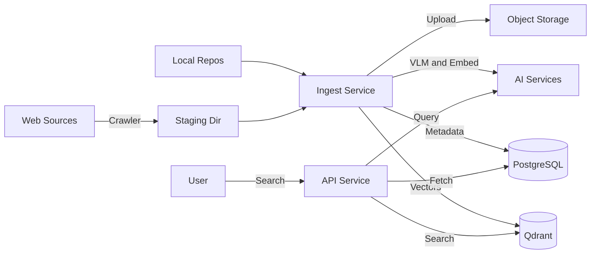

# GEMINI.md - Backend Context for AI Assistants

This file describes the Go backend of the emomo monorepo. For repo-wide context see [../GEMINI.md](../GEMINI.md); for the React frontend see [../frontend/GEMINI.md](../frontend/GEMINI.md).

All commands below assume `cd backend` unless noted.

## 1. Project Overview

**Emomo** is a meme search engine that ingests memes from various sources, indexes them using vector embeddings and visual language models (VLM), and provides a semantic search API.

### Core Components
*   **Crawler (Python, `../crawler/`):** fetches memes from websites (e.g. fabiaoqing) into a local staging area.
*   **Ingestion (Go, `cmd/ingest`):** consumes staging or local repos, generates VLM descriptions and embeddings, uploads images to object storage (S3/R2), and indexes them in Qdrant + a relational DB.
*   **API (Go, `cmd/api`):** REST API (Gin) for searching memes; uses query expansion + vector search.

## 2. Technology Stack

*   **Languages:** Go 1.24+ (this directory), Python 3.12+ (`../crawler`, via `uv`).
*   **Web Framework:** Gin (Go).
*   **Databases:** PostgreSQL (primary metadata, GORM) and Qdrant (vector search).
*   **Storage:** S3-compatible object storage (Cloudflare R2, AWS S3, or MinIO).
*   **AI Models:** OpenAI-compatible VLM for captioning, Jina/OpenAI/ModelScope for text embeddings.
*   **Infrastructure:** Docker Compose for local development (`../deployments/docker-compose.yml`).

## 3. Architecture & Data Flow



## 4. Key Directories (within backend/)

*   `cmd/api/`: REST API server entry (`main.go`).
*   `cmd/ingest/`: Ingestion CLI (`main.go`).
*   `internal/api/`: HTTP handlers and routers.
*   `internal/service/`: Business logic (search, ingest, VLM, embedding, query expansion).
*   `internal/repository/`: Data access layer (DB, Qdrant).
*   `internal/source/`: Adapters for different data sources (staging, ChineseBQB).
*   `configs/`: `config.yaml`, `config.cloud.yaml.example`, `huggingface-spaces.env.example`.
*   `migrations/`: SQL migrations.

## 5. Development & Usage

### Prerequisites
*   Go 1.24+
*   Docker & Docker Compose
*   `uv` (Python package manager) — only needed for the crawler

### Local Setup
1.  Configuration: `cp .env.example .env` and fill in API keys.
2.  Optional infra: `docker compose -f ../deployments/docker-compose.yml up -d` (from repo root) to start API + Alloy.
3.  Crawl into staging:
    ```bash
    cd ../crawler && uv sync
    uv run emomo-crawler crawl --source fabiaoqing --limit 100
    ```
4.  Ingest:
    ```bash
    cd ../backend
    ./scripts/import-data.sh -s staging:fabiaoqing -l 50
    # or: go run ./cmd/ingest --source=staging:fabiaoqing --limit=50
    ```
5.  API server: `go run ./cmd/api`. Defaults to `http://localhost:8080`.

### Common Tasks

*   **Add new ingestion source:**
    1.  Implement `internal/source/Source` interface.
    2.  Register in `cmd/ingest/main.go` and `cmd/api/main.go`.
*   **Add new embedding model:**
    1.  Add an entry under `embeddings:` in `configs/config.yaml` (provider, dimensions, collection, api_key_env).
    2.  Verify it loads via `internal/service/embedding_registry.go`.
*   **Database migrations:** managed via GORM auto-migration in `internal/repository/db.go`; raw SQL companions live in `migrations/`.

## 6. Testing

*   **Go Tests:** `go test ./...`.
*   **Crawler Tests:** see `../crawler/`.
